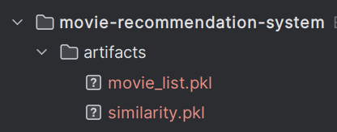
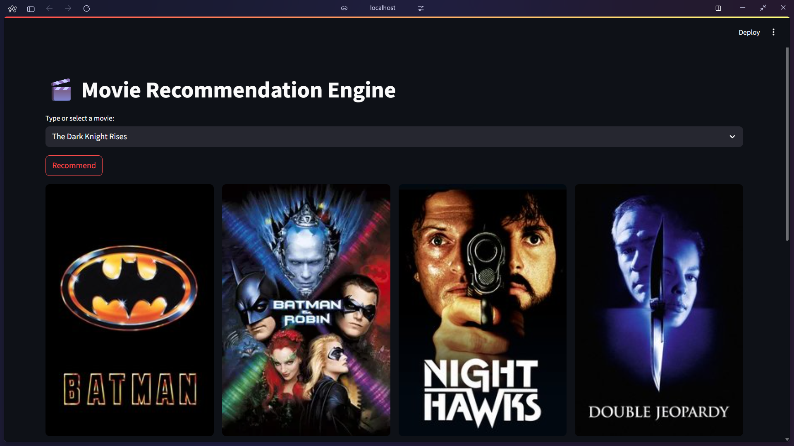
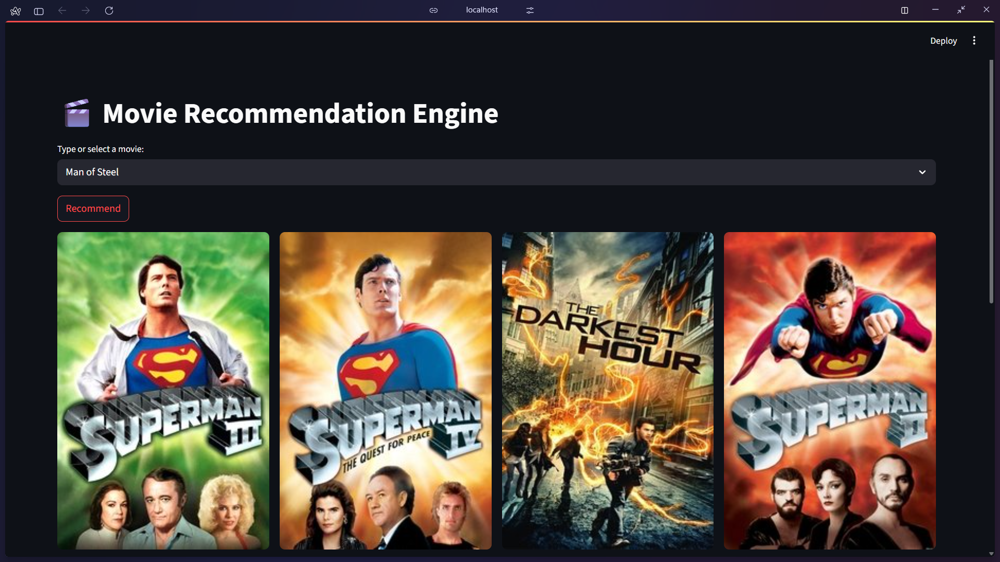

# 🎬 Movie Recommendation Engine

This is a simple movie recommender system built using content-based filtering. It recommends 8 similar movies based on your selection and displays their posters fetched from TMDB.

## 🔧 Features

- Select a movie from a dropdown list
- Get 8 similar movies with posters
- Posters fetched live using the TMDB API
- Works entirely in the browser (via Streamlit)
- Clean 2-row, 4-column layout

## 🚀 How to Run

### 1. Clone the repository
```
git clone https://github.com/your-username/your-repo-name.git
cd your-repo-name
```

### 2. Install dependencies
```
pip install -r requirements.txt
```

### 3. Add your TMDB API key
Create a file named .env in the root of the project and paste:
env
```angular2html
TMDB_API_KEY=your_tmdb_api_key_here
```

### 4. Start the app
```angular2html
streamlit run app.py
```

### 📦 Dataset and Artifacts
All required files for this app (including pickles and raw CSVs) are hosted publicly here:


[[`movie-rec`]]([https://huggingface.co/datasets/saakshammm/movie-rec/tree/main/data](https://huggingface.co/datasets/saakshammm/movie-rec/tree/main))

```
Includes:

tmdb_5000_movies.csv

tmdb_5000_credits.csv

movie_list.pkl

similarity.pkl
```
## 📁 Project Structure
```angular2html
.
├── app.py
├── data/
│   ├── tmdb_5000_credits.csv
│   └── tmdb_5000_movies.csv
├── artifacts/
│   ├── movie_list.pkl
│   └── similarity.pkl
├── requirements.txt
├── .env               # (not pushed to GitHub)
└── README.md
```

## 🌐 Deployment
This app is ready for free hosting via Streamlit Cloud.

Push the code to a GitHub repo

Go to Streamlit Cloud and deploy the repo

Set the TMDB key via "Secrets" in Streamlit:

Key: TMDB_API_KEY

Value: your_actual_key

## 🧠 Built With
```angular2html
Streamlit
Scikit-learn
Nltk
Pandas
Requests
The Movie Database (TMDB) API
Pickle 
```

Place them inside a local `artifacts/` folder like this:



## 📸 Example
Select a movie → Get recommendations → See poster previews instantly.



## 🔐 Note on Security
Your TMDB API key is loaded securely from environment variables using python-dotenv. Never hardcode keys.

## 👤 Author
Saksham Kumar

